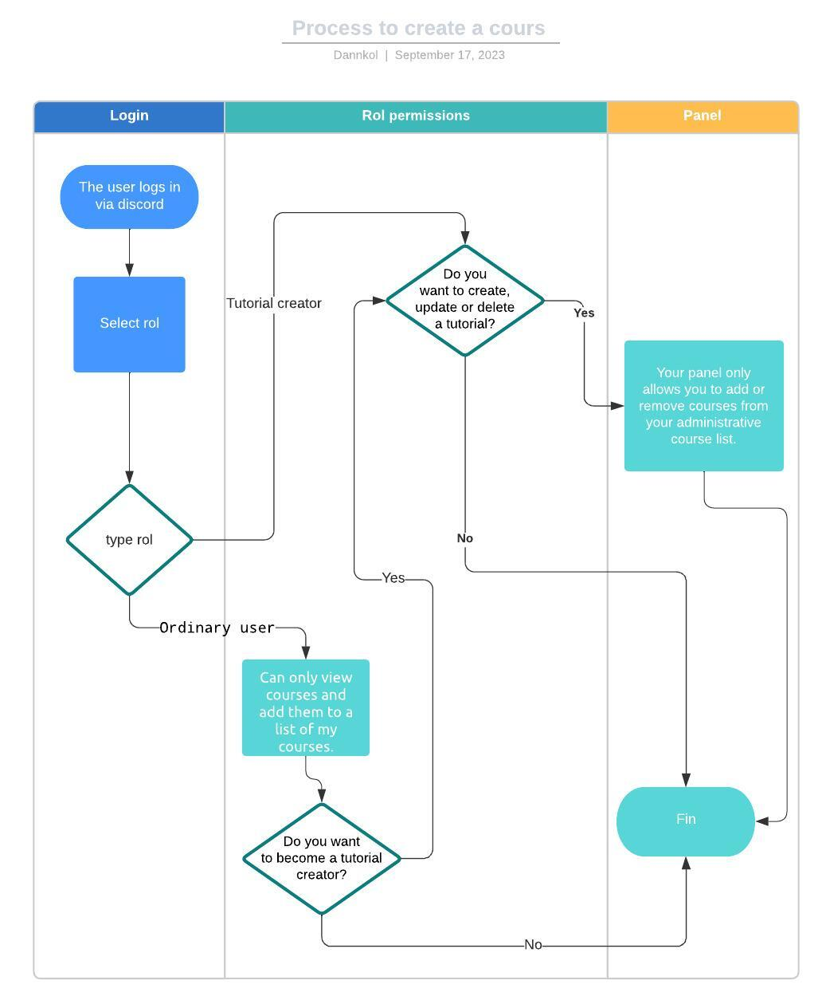
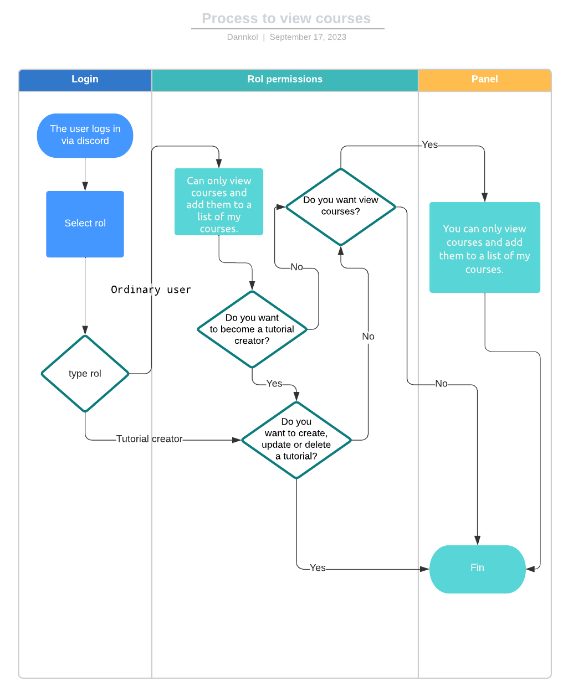

# Ucamp
An  online course platform for use in the campuslands network, developed and powered by the camper community (students and employees).

# Product Spec

## 👀 Problem

> **How can we distribute courses and educational content in the camper community?**
> 
- Using educational platforms
- Using server dircord
- Create our own network to distribute the content in our internal network

---

## 💭 Proposal

> **To improve, the proposal involves the creation of our own content distribution system, using as a base platforms used in the market and discord.**
> 
- In this system it should be possible to create courses with classes containing title, summary and content that can be video, text or both.
- It must be possible to log in and register with discord.
- Users can view or create courses
- Views should be simple and responsive

---

## 👾 Roles general specifications

<table>
    <thead>
        <tr>
            <th>Roles</th>
            <th>Goals</th>
            <th>Not-Goals</th>
        </tr>
    </thead>
    <tbody>
        <tr>
            <td rowspan=2 align="center"><b>Ordinary user</b></td>
            <td align="justify">You can only view courses and add them to a list of my courses. 🧑‍🏫</td>
            <td align="justify">You can become a tutorial creator</td>
        </tr>
        <tr>
            <td align="justify">Your administrative panel only allows you to add or remove courses from your course list.</td>
            <td rowspan=3 align="justify">Points system for a store 🪙</td>
        </tr>
        <tr>
            <td rowspan=2 align="center"><b>Tutorial creator</b></td>
            <td align="justify">You can create courses or display.</td>
        </tr>
        <tr>
            <td align="justify">Your administrative panel only allows you to create or delete courses and classes.</td>
        </tr>
    </tbody>
</table>

### Process to create a course 

### Process to view courses 

---

## 🔗 Links

