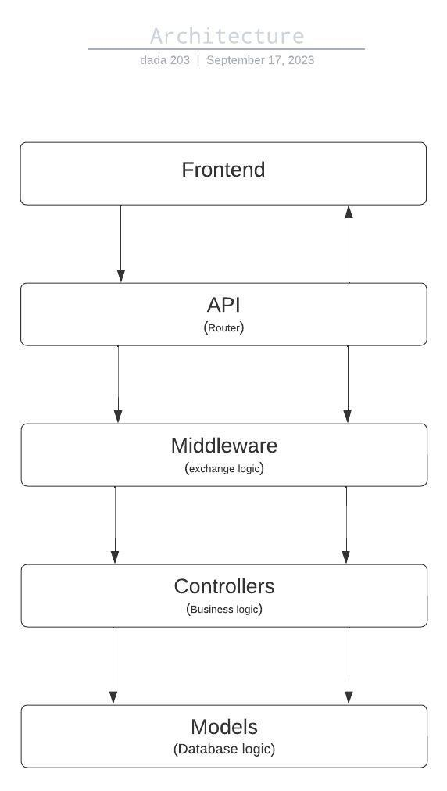

# 👷 Folder structure

## 🏗️ Architecture

Our architecture is layered software architecture.

The layered architecture style is one of the most common architectural styles. The idea behind Layered Architecture is that modules or components with similar functionalities are organized into horizontal layers. As a result, each layer performs a specific role within the application.

## Advantages

* The framework is simple and easy to learn and implement.
* There is reduced dependency because the function of each layer is separate from the other layers.
* Testing is easier because of the separated components, each component can be tested individually.
* Cost overheads are fairly low.

## Flowchart



## TREE

```bash
.
├── db
│   └── database.mongodb.js
├── documents
│   └── Folder_structure.md
├── Img
│   ├── Architecture.jpeg
│   ├── Process_to_create_a_course.jpeg
│   └── Process_to_view_courses.png
├── package.json
├── package-lock.json
├── README.md
├── src
│   ├── config
│   │   └── config.js
│   ├── controllers
│   │   └── controller.js
│   ├── middleware
│   │   └── middleware.js
│   ├── models
│   │   └── model.js
│   └── routes
│       └── v1
│           └── routes.js
└── views
    ├── index.html
    ├── package.json
    ├── package-lock.json
    ├── public
    │   └── vite.svg
    ├── README.md
    ├── src
    │   ├── App.css
    │   ├── App.jsx
    │   ├── assets
    │   │   └── react.svg
    │   ├── index.css
    │   └── main.jsx
    └── vite.config.js
```


