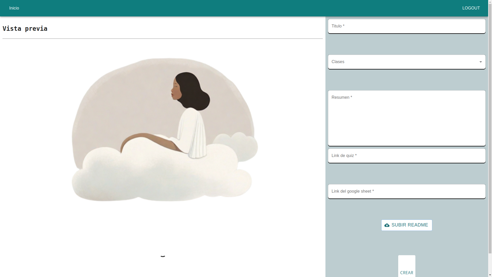
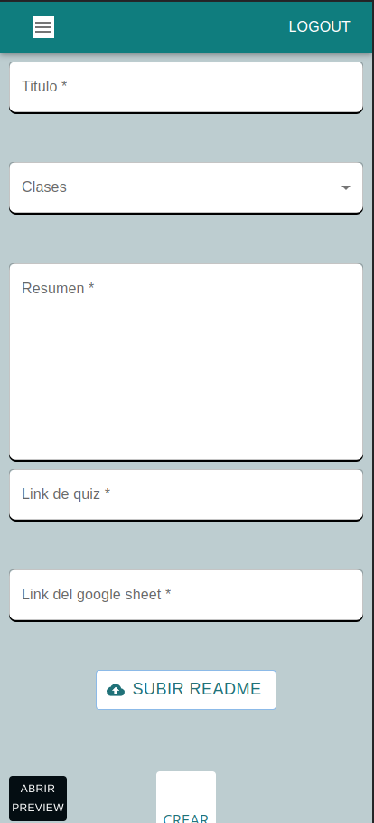
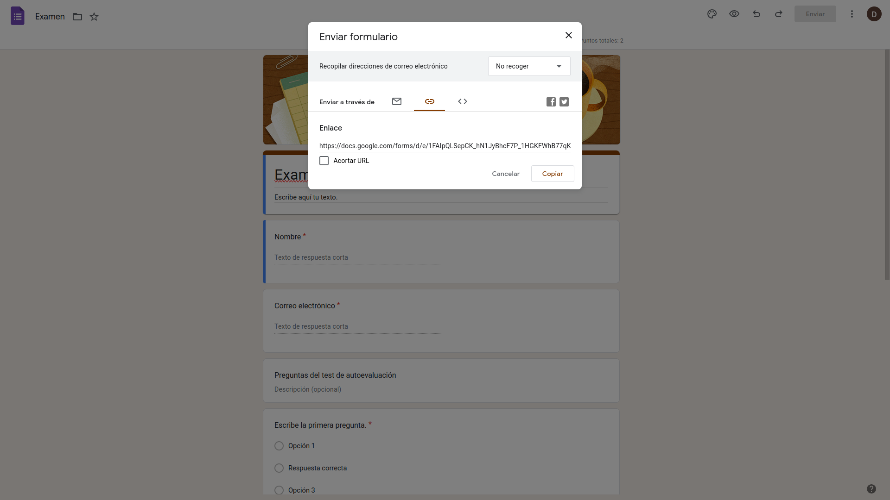
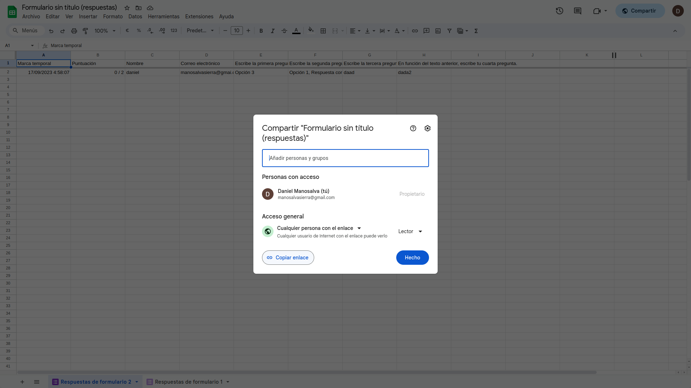
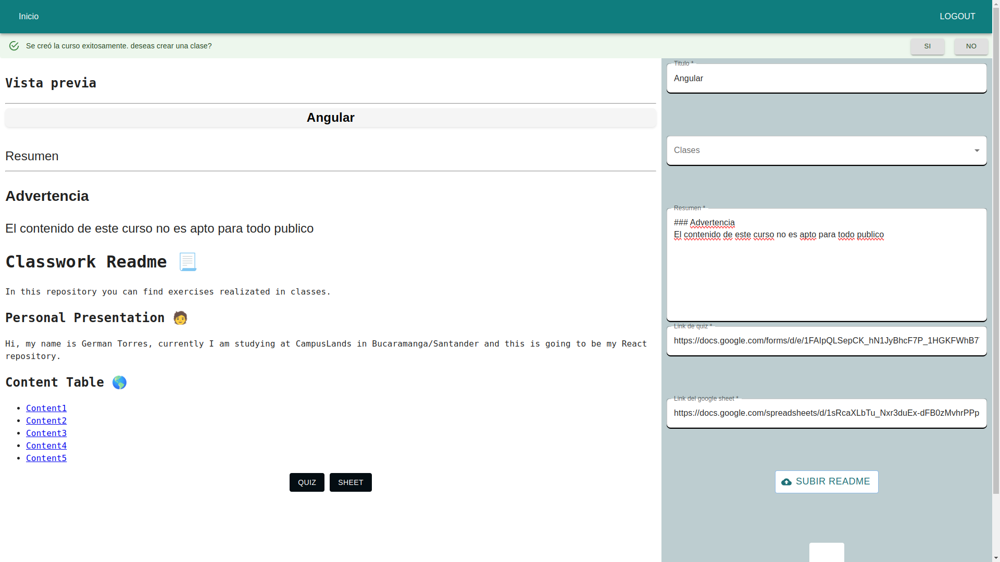
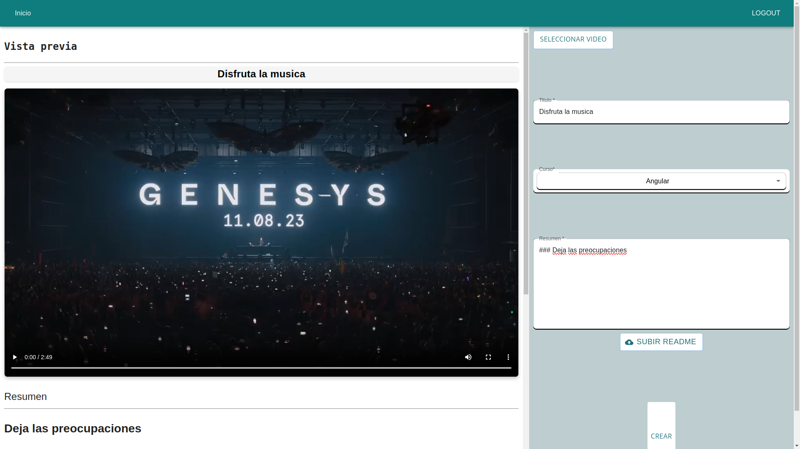

## API Reference

#### Post subir una clase o curso

```http
  POST /upload
```

`NOTA: ENDPOINT FUNCIONAL TANTO PARA SUBIR CURSOS COMO PARA SUBIR CLASES`

| Parameter | Type     | Description                |
| :-------- | :------- | :------------------------- |
| `user` | `express-session` | **express-session** |
| `classes` | `array` | clases del curso |
| `title` | `string` | **Requerido** titulo del curso |
| `summary` | `string` | **Requerido** resumen del curso |
| `quiz` | `array` | **Requerido** link de google form y google sheet |
| `content` | `string` | **Requerido** path de los archivos del curso o clase |
| `curso` | `string` |  curso al que pertenece |

#### Get obtener id y titulo del curso

```http
  GET /all/courses
```

| Parameter | Type     | Description                |
| :-------- | :------- | :------------------------- |
| `user` | `express-session` | **express-session** |

#### Get obtener id y titulo del curso

```http
  GET /all/clases
```

| Parameter | Type     | Description                |
| :-------- | :------- | :------------------------- |
| `user` | `express-session` | **express-session** |

#### Get obtener contenido de las clases

```http
  GET /all/content/clases
```

| Parameter | Type     | Description                |
| :-------- | :------- | :------------------------- |
| `user` | `express-session` | **express-session** |

## Intrucciones de uso

### Crear nuevo curso

##### Escritorio


<blockquote cite="">
  <p>Crear nuevo curso Escritorio</p>
  <footer>- Vista para crear nuevo curso</footer>
</blockquote>

##### Movile

<table>
    <thead>
        <tr>
            <th>Close</th>
            <th>Open</th>
        </tr>
    </thead>
    <tbody>
        <tr>
            <td align="center">
                
                <blockquote cite="">
                    <p>Crear nuevo curso Movile</p>
                    <footer>- Vista para crear nuevo curso</footer>
                </blockquote>
            </td>
            <td align="center">
                
                <blockquote cite="">
                    <p>Crear nuevo curso Movile</p>
                    <footer>- Vista para crear nuevo curso</footer>
                </blockquote>            
            </td>
        </tr>
    </tbody>
</table>

#### Obtener links del google form y google sheet

<table>
    <thead>
        <tr>
            <th>Google Form</th>
            <th>Open</th>
        </tr>
    </thead>
    <tbody>
        <tr>
            <td align="justify">
                
                <blockquote cite="">
                    <p>Obtener link del quiz</p>
                </blockquote>
                <ul>
                    <li>Crea un nuevo formulari en <a href="https://docs.google.com/forms">forms</a></li>
                    <li>Abre el formulario creado y da click en enviar, busca la opcion de link y copa el link</li>
                </ul>
            </td>
            <td align="justify">
                
                <blockquote cite="">
                    <p>Obtener link del sheet o calificaciones</p>
                </blockquote>
                <ul>
                    <li>En nuestro formulario de google form buscamos la seccion de respuestas y damos click en `Vincular con Hojas de cálculo`</li>
                    <li>Creamos una automatica</li>
                    <li>En el google sheet damos click en compartir y en el acceso general seleccionamos `Cualquier persona con enlace`</li>
                </ul>      
            </td>
        </tr>
    </tbody>
</table>

#### Curso subido exitosamente


<blockquote cite="">
    <p>Se creo exitosamente el curso</p>
</blockquote>

#### Crear clase


<blockquote cite="">
    <p>Crea nueva clase</p>  
</blockquote>

* Seleciona un video para la clase **OPCIONAL**
* Seleciona un readme para la clase **OPCIONAL**
* Seleciona el curso al que pertenece **REQUERIDO**
* Escribe un pequeño resumen **REQUERIDO**


