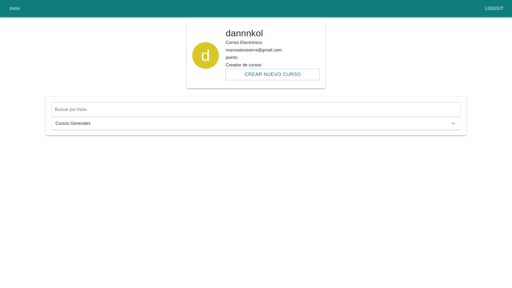
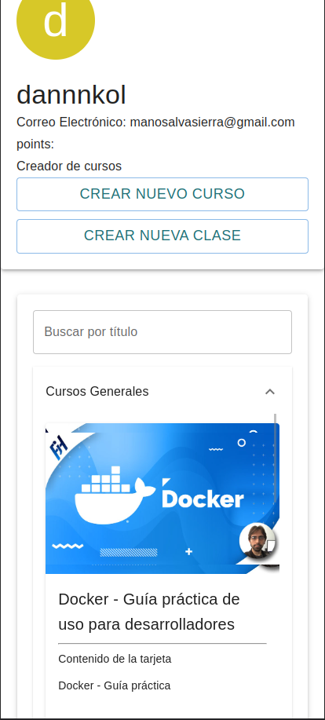
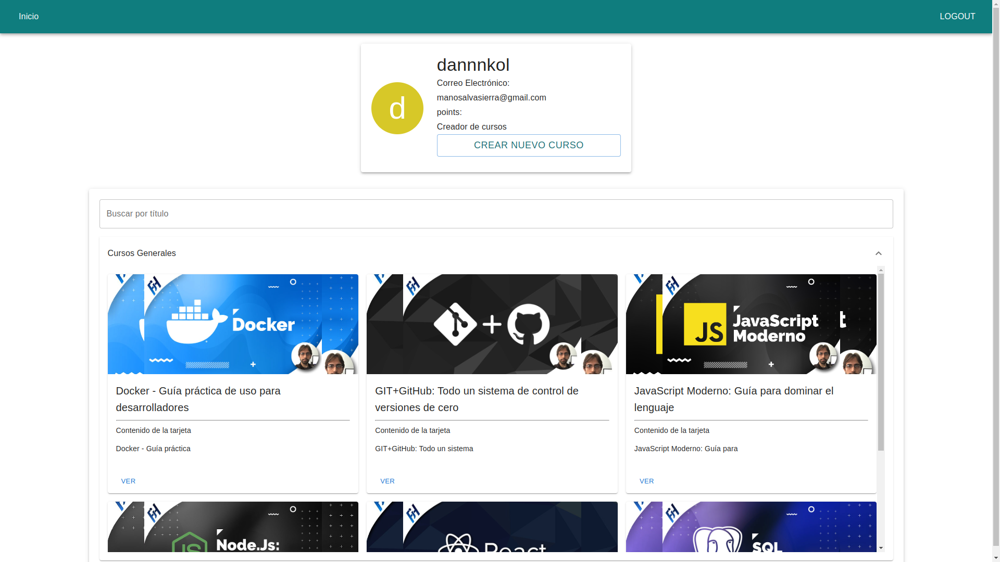
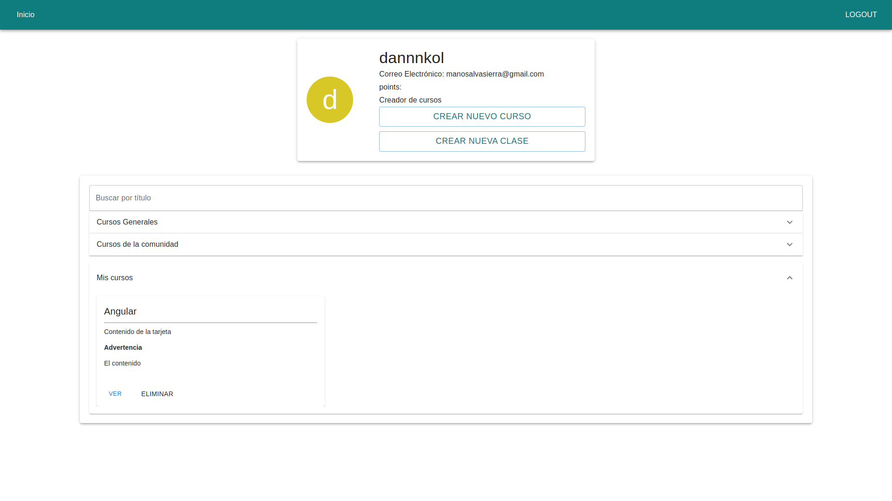

## API Reference

#### Get all course

```http
  GET /dashboard/all/course
```

| Parameter | Type     | Description                |
| :-------- | :------- | :------------------------- |
| `user` | `express-session` | **express-session** |

#### Get my list of courses

```http
  GET /dashboard/mylist
```

| Parameter | Type     | Description                |
| :-------- | :------- | :------------------------- |
| `user` | `express-session` | **express-session** |

#### Get info user

```http
  GET /dashboard/info/user
```

| Parameter | Type     | Description                |
| :-------- | :------- | :------------------------- |
| `user` | `express-session` | **express-session** |

#### Get delete course in my list

```http
  GET /dashboard/mylist/delate/:idcourse
```

| Parameter | Type     | Description                |
| :-------- | :------- | :------------------------- |
| `idcourse` | `ObjectId` | **Id of course** |
| `user` | `express-session` | **express-session** |

#### Get delete my course

```http
  GET /dashboard/mycourses/delate/:idcourse
```

| Parameter | Type     | Description                |
| :-------- | :------- | :------------------------- |
| `idcourse` | `ObjectId` | **Id of course** |
| `user` | `express-session` | **express-session** |

#### Get update rol

```http
  GET /dashboard/update/rol
```

| Parameter | Type     | Description                |
| :-------- | :------- | :------------------------- |
| `user` | `express-session` | **express-session** |

## Intrucciones de uso

### Dashboard

##### Escritorio


<blockquote cite="">
  <p>Dashboard Escritorio</p>
  <footer>- Vista del dashboard En escritorio</footer>
</blockquote>

##### Movile


<blockquote cite="">
  <p>Dashboard Movile</p>
  <footer>- Vista del dashboard En movile</footer>
</blockquote>

#### Ver un Curso General


<blockquote cite="">
  <p>Dashboard Cursos Generales</p>
  <footer>- Vista del dashboard con el acordeon de los cursos generales</footer>
</blockquote>

* Da click en el accordeon Cursos Generales
* En la listado de cursos da click en ver
* Tambien puedes buscar desde la barra buscar por titulo

#### Ver un curso diferente a los generales


<blockquote cite="">
  <p>Dashboard Mis cursos</p>
  <footer>- Vista del dashboard con el acordeon de mis cursos</footer>
</blockquote>

* Da click en el accordeon del curso a buscar
* En la listado de cursos da click en ver
* Tambien puedes buscar desde la barra buscar por titulo
