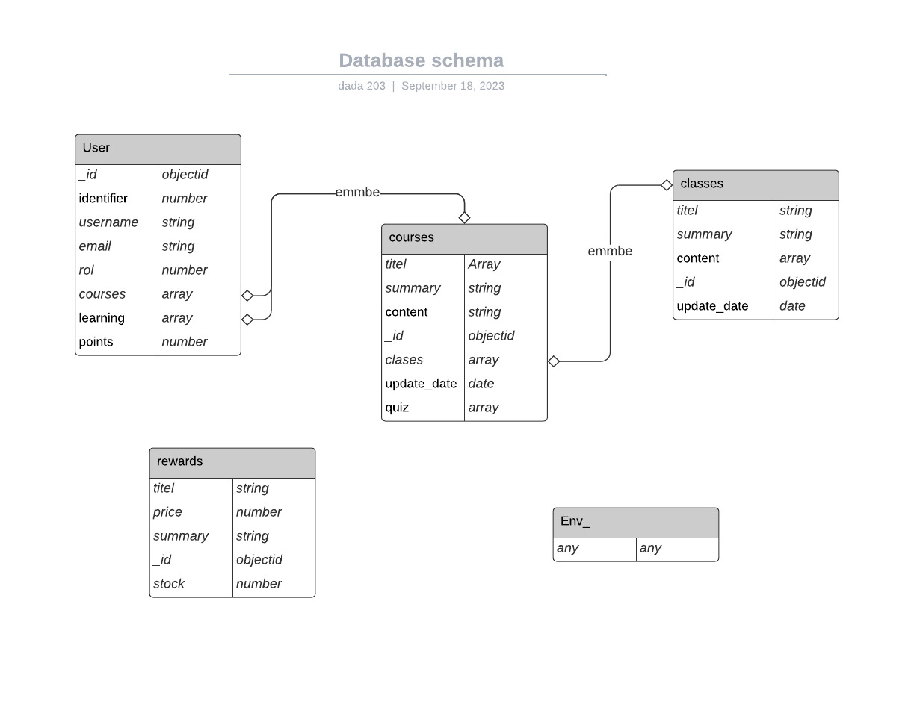

# 🗃️ Database schema

## 📜 Database schema



## Json examples

* User

```json
{
    _id: "fasdfwsfew5343123oj3254",
    identifier: "fasdfwsfew5343123oj3254",
    username: "dannkol",
    email: "dannkol@gmail.com",
    rol: 1,
    courses: [ // This field is empty if the user is ordinary
        {
            _id: "sdfsdfse23423sdaas",
            classes : [
                {
                    _id : "asdasf012q3423gwes21"
                    title : "React Native for dummies",
                    summary: "lorem",
                    content: [
                        "url_video",
                        "text",
                        "taks",
                        "md code"
                    ],
                    update_date: "2023-09-02"
                },
                {
                    _id : "asdasf012qdsf3gwes21"
                    title : "React for dummies",
                    summary: "lorem",
                    content: [
                        "url_video",
                        "text",
                        "taks",
                        "md code"
                    ],
                    update_date: "2023-09-04"
                }
            ],
            title : "React",
            summary : "React",
            content : "Lorem",
            quiz: ["url_quiz", "url_sheet"],
            update_date: "2023-09-04"

        }
    ],
    learning: [
        {
            _id: "sdfsdfse23423sdaas",
            classes : [
                {
                    _id : "asdasf012q3423gwes21"
                    title : "React Native for dummies",
                    summary: "lorem",
                    content: [
                        "url_video",
                        "text",
                        "taks",
                        "md code"
                    ],
                    update_date: "2023-09-02"
                },
                {
                    _id : "asdasf012qdsf3gwes21"
                    title : "React for dummies",
                    summary: "lorem",
                    content: [
                        "url_video",
                        "text",
                        "taks",
                        "md code"
                    ],
                    update_date: "2023-09-04"
                }
            ],
            title : "React",
            summary : "React",
            content : "Lorem",
            update_date: "2023-09-04",
            status : 1
        }
    ]
}
```

* course_default

```json
[
    
    {
        _id: "sdfsdfse23423sdaas",
        classes : [
            {
                _id : "asdasf012q3423gwes21"
                title : "React Native for dummies",
                summary: "lorem",
                content: "url_video",
                update_date: "2023-09-02",
                author : "Gorge"
            },
            {
                _id : "asdasf012qdsf3gwes21"
                title : "React for dummies",
                summary: "lorem",
                content: "url_video",
                update_date: "2023-09-04",
                author : "Gorge"
            }
        ],
        title : "React",
        summary : "React",
        content : "Lorem",
        update_date: "2023-09-04",
        author : "Gorge"
    }
    
]
```

* rewards

```json
{
    _id : "askasf112213jfdsl2",
    title : "Free empanada",
    price : 120000,
    summary : "Free empanada",
    content : "...",
    stock : 10
}
```