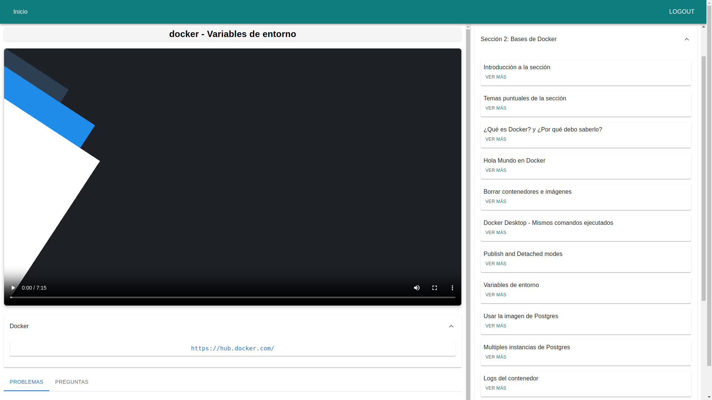
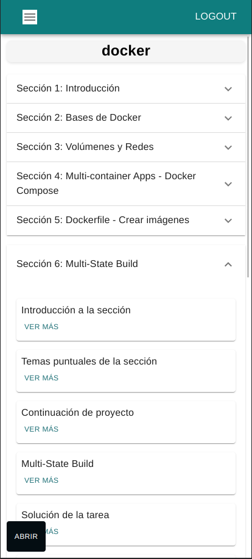
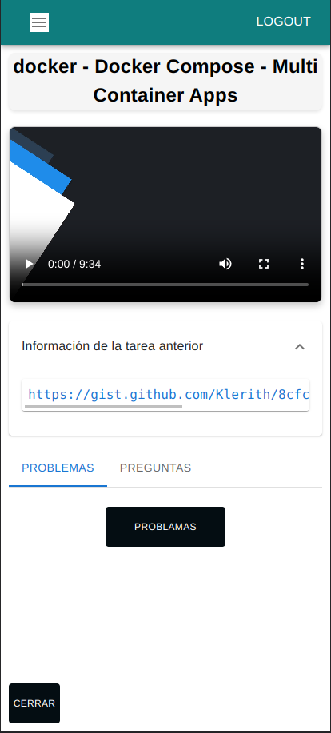
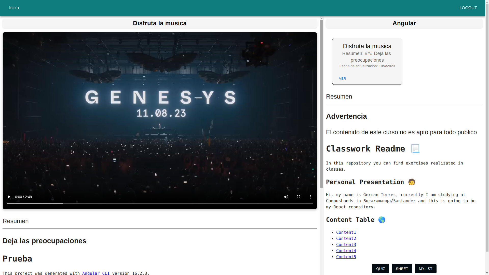
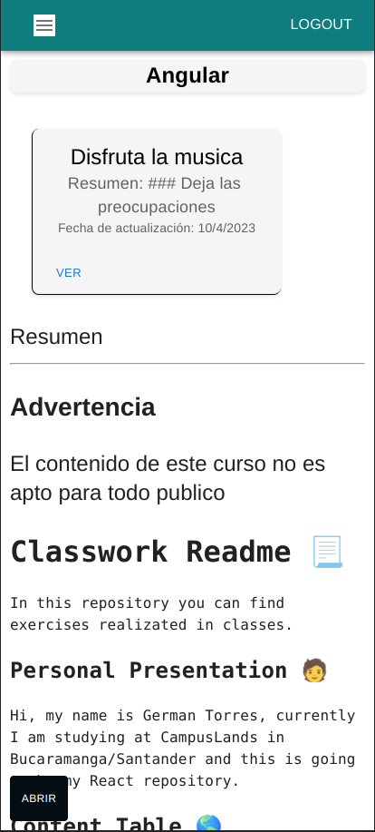
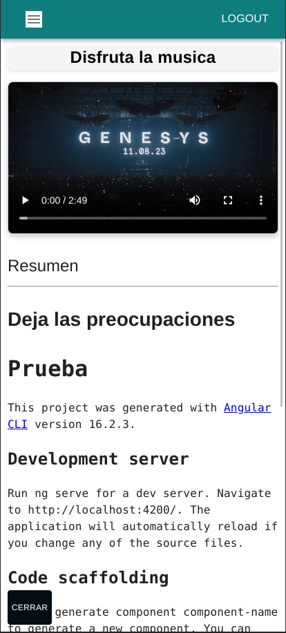

## API Reference

#### Get video

```http
  GET /getVideo/:videoId
```

| Parameter | Type     | Description                |
| :-------- | :------- | :------------------------- |
| `user` | `express-session` | **express-session** |
| `:videoId` | `string` | id para referenciar el video (path) |

#### Get readme

```http
  GET /getReadme/:readmeId
```

| Parameter | Type     | Description                |
| :-------- | :------- | :------------------------- |
| `user` | `express-session` | **express-session** |
| `:readmeId` | `string` | id para referenciar el readme (path) |

#### Get info del curso

```http
  GET /infocourse/:id
```

| Parameter | Type     | Description                |
| :-------- | :------- | :------------------------- |
| `user` | `express-session` | **express-session** |
| `:id` | `objectid` | id para referenciar el curso |

#### Get add a la lista

```http
  GET /addmylist/:idcourse
```

| Parameter | Type     | Description                |
| :-------- | :------- | :------------------------- |
| `user` | `express-session` | **express-session** |
| `:idcourse` | `objectid` | id para referenciar el curso |

## Intrucciones de uso

### Cursos generales

#### Escritorio


<blockquote cite="">
    <p>Vista seleccionar clase para ver</p>
    <p>Puedes seleccionar la clase para ver en el acordeon</p>
</blockquote>

#### Movile

<table>
    <thead>
        <tr>
            <th>Close</th>
            <th>Open</th>
        </tr>
    </thead>
    <tbody>
        <tr>
            <td align="justify">
                
                <blockquote cite="">
                    <p>Vista acordeon de secciones</p>
                </blockquote>
                    <ul>
                        <li>Puedes seleccionar la clase para ver</li>
                        <li>Da click en el boton negro de la ezquina inferior que dice abrir para ver la clase</li>
                    </ul>
            </td>
            <td align="justify">
                
                <blockquote cite="">
                    <p>Vista preview clase</p>
                </blockquote>            
            </td>
        </tr>
    </tbody>
</table>


### Cursos no generales (Cursos de la comunidad)


<blockquote cite="">
    <p>Vista seleccionar clase para ver</p>
    <p>Puedes seleccionar la clase para ver en dando click en ver en la card de la ezquina superiro derecha</p>
</blockquote>


#### Movile

<table>
    <thead>
        <tr>
            <th>Close</th>
            <th>Open</th>
        </tr>
    </thead>
    <tbody>
        <tr>
            <td align="justify">
                
                <blockquote cite="">
                    <p>Vista ver curso</p>
                </blockquote>
                    <ul>
                        <li>Puedes seleccionar la clase para ver en dando click en ver en la card de la ezquina superiro derecha</li>
                        <li>Da click en el boton negro de la ezquina inferior que dice abrir para ver la clase</li>
                    </ul>
            </td>
            <td align="justify">
                
                <blockquote cite="">
                    <p>Vista preview clase</p>
                </blockquote>            
                    <ul>
                        <li>Da click en el boton negro de la ezquina inferior que dice cerrar para ver el curso</li>
                    </ul>
            </td>
        </tr>
    </tbody>
</table>